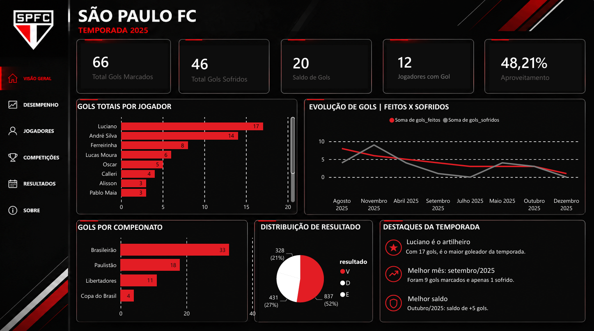

# ⚽ Dashboard São Paulo FC - Temporada 2025

## 📖 Sobre o projeto

Este projeto consiste em um dashboard interativo desenvolvido no **Power BI** para análise da temporada 2025 do São Paulo Futebol Clube.

O objetivo foi transformar dados esportivos em informações visuais, permitindo acompanhar o desempenho da equipe por meio de indicadores, gráficos e métricas.

Todo o banco de dados foi criado por mim no **MySQL Workbench**, incluindo a modelagem das tabelas e a utilização de consultas SQL para estruturar os dados utilizados no dashboard.

## 📸 Dashboard




---

## 📊 Indicadores apresentados

- ⚽ Total de gols marcados
- 🛡️ Total de gols sofridos
- ➕ Saldo de gols
- 👤 Jogadores com gols
- 📈 Aproveitamento da equipe
- 📊 Evolução dos gols marcados e sofridos
- 🏆 Gols por competição
- 📋 Distribuição dos resultados
- ⭐ Destaques da temporada

---

## 🛠️ Tecnologias utilizadas

- Power BI
- Power Query
- DAX
- SQL
- MySQL Workbench

---

## 🗄️ Banco de Dados

O banco de dados foi desenvolvido do zero utilizando o **MySQL Workbench**, incluindo:

- Modelagem das tabelas
- Relacionamentos
- Criação da estrutura do banco
- Consultas SQL
- Organização dos dados para análise no Power BI

---

## 📁 Estrutura do projeto

```
📂 spfc-powerbi-dashboard
│
├── Dashboard.pbix
├── banco.sql
├── dashboard.png
└── README.md
```

---

## 🎯 Objetivo

Este projeto foi desenvolvido para colocar em prática conhecimentos em:

- Business Intelligence
- Visualização de Dados
- Modelagem de Dados
- SQL
- Power BI
- DAX
- Power Query

---

## 👩‍💻 Desenvolvido por

**Andressa Silva Xavier**

🔗 LinkedIn: https://www.linkedin.com/in/andressa-xavier-2b393a271/
